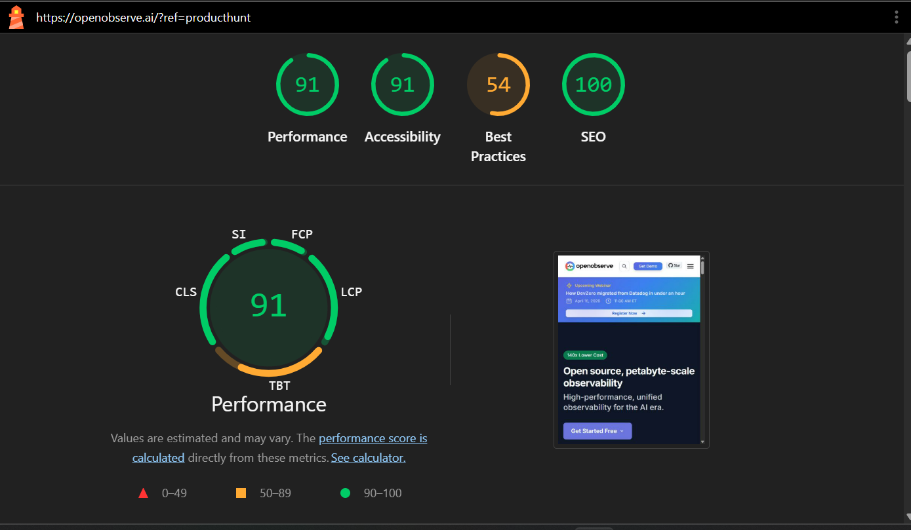
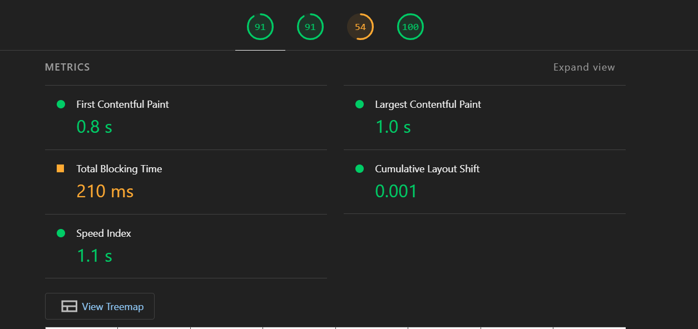
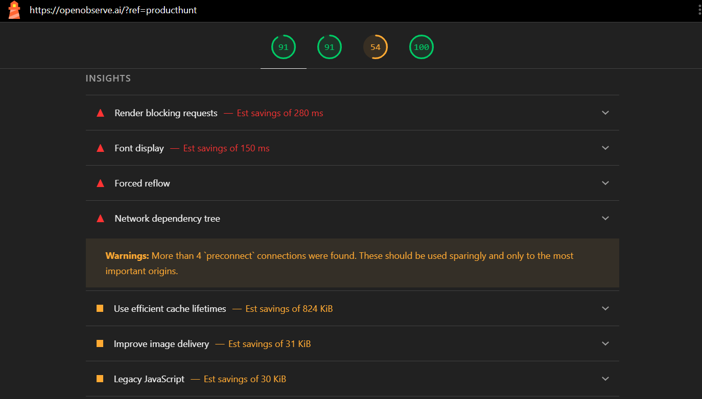
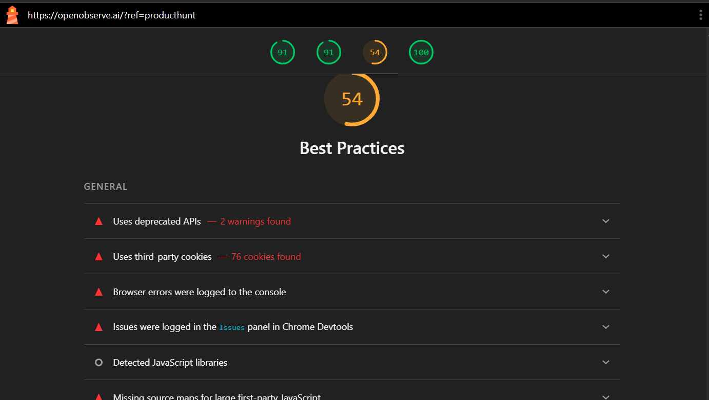
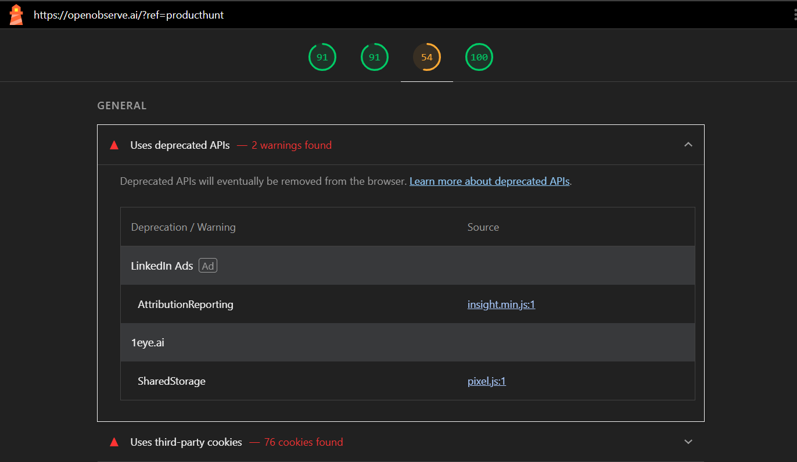
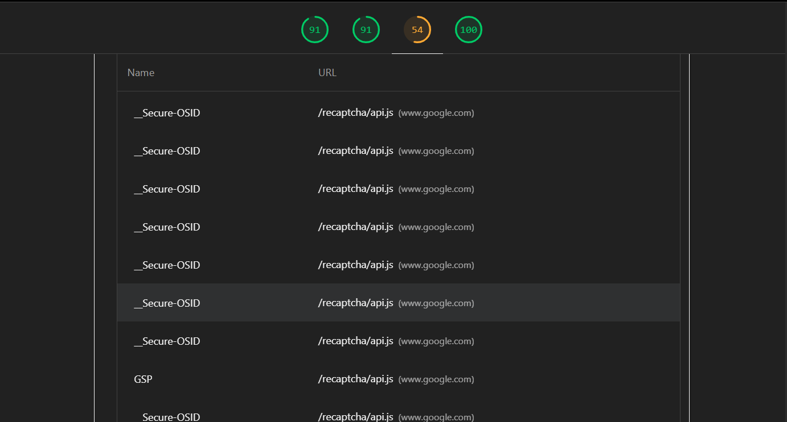
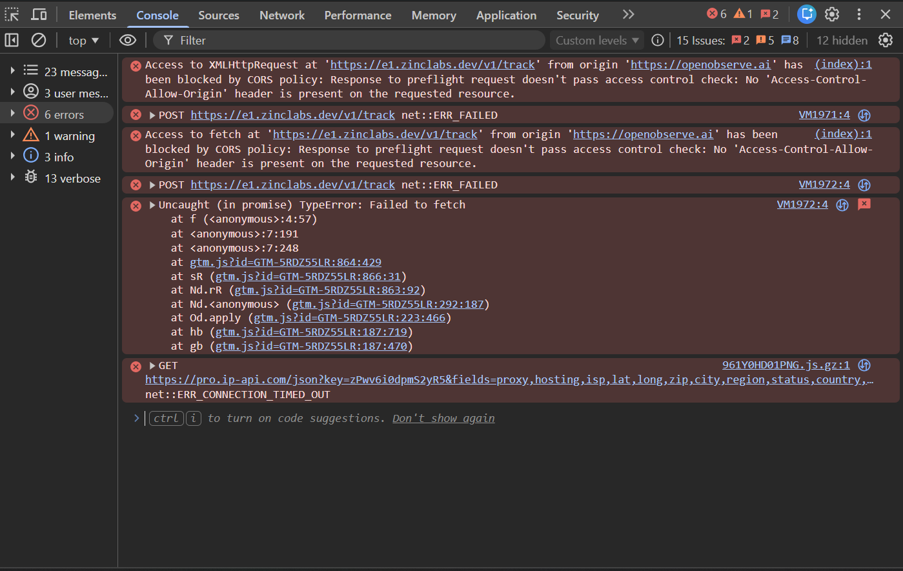
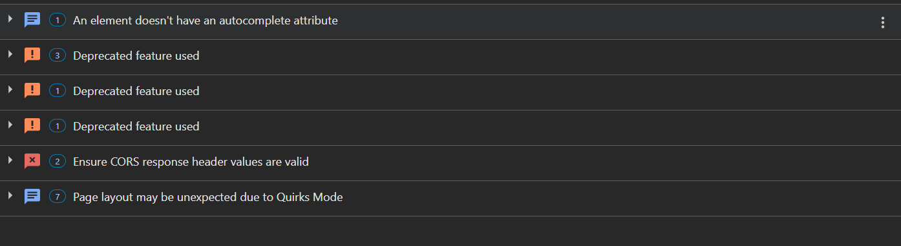

# SaaS Audit Report – OpenObserve

## Overview
This report analyzes the performance, security, and reliability of the OpenObserve web application.

---

## 1. Performance Analysis
### Overview
The application demonstrates strong overall performance with a Lighthouse score of **91/100**, indicating a well-optimized frontend experience. Core performance metrics such as First Contentful Paint (FCP) and Largest Contentful Paint (LCP) are within optimal ranges.

---

### Key Metrics

- **First Contentful Paint (FCP):** 0.8s  
- **Largest Contentful Paint (LCP):** 1.0s  
- **Speed Index:** 1.1s  
- **Total Blocking Time (TBT):** 210ms  
- **Cumulative Layout Shift (CLS):** 0.001  

---

### Insights & Issues

#### 1. Render Blocking Resources
- Estimated savings: ~280ms  
- Certain CSS/JS files are blocking initial rendering.

**Impact:**  
Delays page interactivity and increases perceived load time.

**Recommendation:**  
- Use `defer` or `async` for non-critical JS  
- Inline critical CSS  

---

#### 2. Font Loading Delays
- Estimated savings: ~150ms  

**Impact:**  
Text rendering delay (FOIT/FOUT), affecting user experience.

**Recommendation:**  
- Use `font-display: swap`  
- Preload critical fonts  

---

#### 3. Excessive Preconnect Usage
- More than 4 preconnect connections detected  

**Impact:**  
Unnecessary network overhead and DNS lookups.

**Recommendation:**  
- Limit preconnect to critical origins only  

---

#### 4. Inefficient Cache Policies
- Potential savings: ~824 KiB  

**Impact:**  
Repeated downloads increase load time for returning users.

**Recommendation:**  
- Implement longer cache lifetimes for static assets  

---

#### 5. Unused / Legacy JavaScript
- Unused JS: ~765 KiB  
- Legacy JS: ~30 KiB  

**Impact:**  
Increased bundle size and slower execution.

**Recommendation:**  
- Remove unused code  
- Implement code splitting  
- Serve modern JS bundles  

---

#### 6. Large Network Payloads
- Total transfer size: ~3.4 MB  

**Impact:**  
Slower load times, especially on slower networks.

**Recommendation:**  
- Compress assets (gzip/brotli)  
- Optimize images and scripts  

---

#### 7. Main Thread Work
- Total blocking work: ~4.2s  

**Impact:**  
Delays user interaction and responsiveness.

**Recommendation:**  
- Break large tasks into smaller chunks  
- Use Web Workers where applicable  

---

### Summary

The application is already performing at a high level, but several optimization opportunities exist, particularly around JavaScript execution, caching strategies, and resource loading. Addressing these issues could further improve responsiveness and scalability, especially under real-world network conditions.
### Supporting Evidence

## 2. Best Practices & Code Quality
### Overview

The application scored **54/100 in Best Practices**, indicating several issues related to modern web standards, browser compatibility, and code reliability. These issues primarily stem from deprecated APIs, excessive third-party dependencies, and runtime errors.

---

### Key Issues Identified

#### 1. Use of Deprecated APIs

**Evidence:**
- Deprecated features detected in:
  - LinkedIn Ads (AttributionReporting)
  - SharedStorage API usage (pixel.js)
- Multiple deprecation warnings observed in DevTools

**Impact:**
- Future browser incompatibility
- Potential feature breakage as APIs are removed
- Reduced long-term maintainability

**Recommendation:**
- Replace deprecated APIs with modern alternatives
- Audit third-party scripts for outdated implementations

---

#### 2. Excessive Third-Party Cookies & Scripts

**Evidence:**
- 76 third-party cookies detected
- External dependencies include:
  - Google (reCAPTCHA, Analytics, Ads)
  - LinkedIn Ads
  - HubSpot
  - Clarity
  - YouTube
  - Sovrn / Lijit
  - IP tracking services

**Impact:**
- Increased attack surface
- Privacy and compliance concerns (GDPR risk)
- Performance degradation due to multiple external calls

**Recommendation:**
- Reduce third-party integrations
- Consolidate analytics providers
- Prefer first-party tracking where possible

---

#### 3. Console Errors (Critical Runtime Issues)

**Evidence:**
- CORS failure when calling:
  https://e1.zinclabs.dev/v1/track
- Error:
  "No 'Access-Control-Allow-Origin' header is present"
- Failed network requests and unhandled promise rejections :contentReference[oaicite:0]{index=0}
- Timeout error:
  https://pro.ip-api.com → ERR_CONNECTION_TIMED_OUT

**Impact:**
- Broken analytics / tracking functionality
- Silent failures affecting business metrics
- Poor debugging visibility
- Potential user-facing issues in edge cases

**Recommendation:**
- Fix CORS configuration on backend:
  - Add `Access-Control-Allow-Origin`
- Handle failed requests gracefully
- Remove or replace failing external services

---

#### 4. Browser Issues Detected

**Evidence (DevTools Issues panel):**
- CORS policy misconfiguration
- Deprecated feature usage
- Missing autocomplete attributes
- Quirks Mode rendering warnings

**Impact:**
- Inconsistent rendering across browsers
- Reduced accessibility and UX reliability
- Increased maintenance complexity

**Recommendation:**
- Ensure proper DOCTYPE to avoid Quirks Mode
- Fix CORS headers
- Add missing HTML attributes
- Resolve all DevTools Issues panel warnings

---

#### 5. Missing Source Maps

**Evidence:**
- Large JavaScript bundles without source maps

**Impact:**
- Difficult debugging in production
- Slower issue resolution

**Recommendation:**
- Enable source maps for production debugging (with proper security controls)

---

### Summary

The application shows strong performance but lacks adherence to modern best practices. The primary concerns include reliance on third-party services, deprecated API usage, and runtime errors caused by misconfigured network requests.

Addressing these issues will significantly improve stability, maintainability, and long-term scalability.
### Supporting Evidence

## 3. API & Network Analysis

## 4. Security Analysis

## 5. Storage & Session Management

## 6. Cookie & Tracking Analysis

## 7. Third-Party Dependency Analysis

## Final Summary & Recommendations
