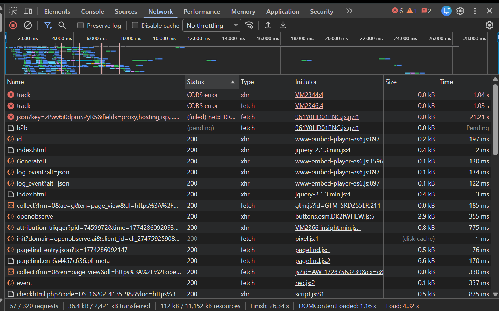
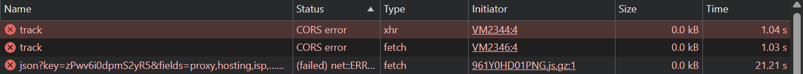
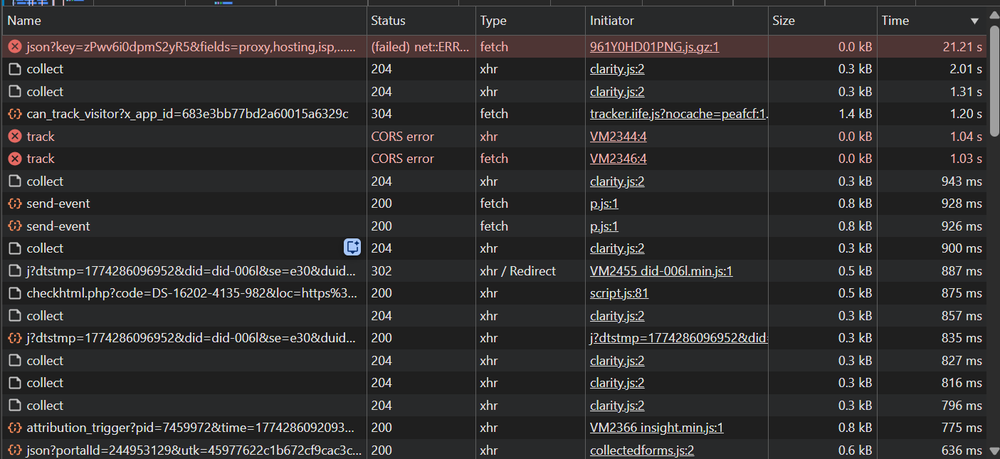
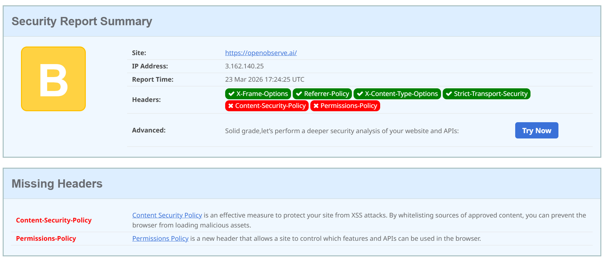
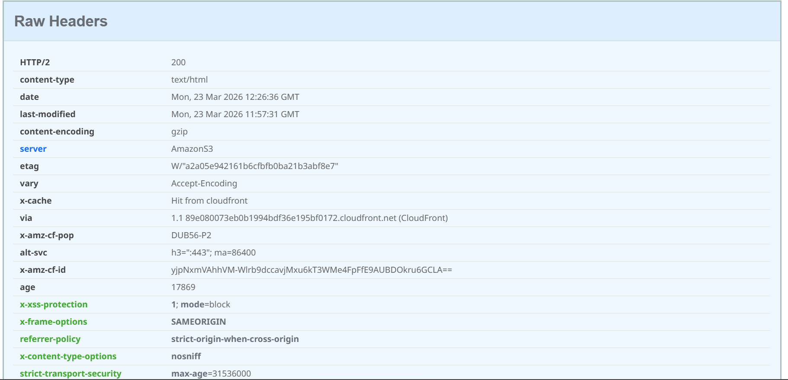
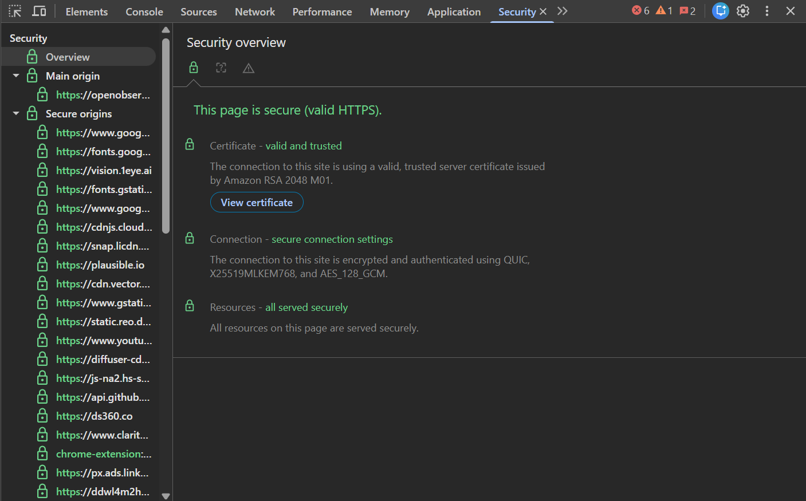
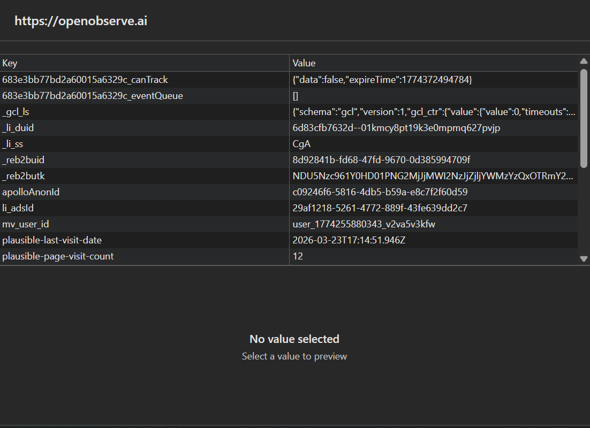
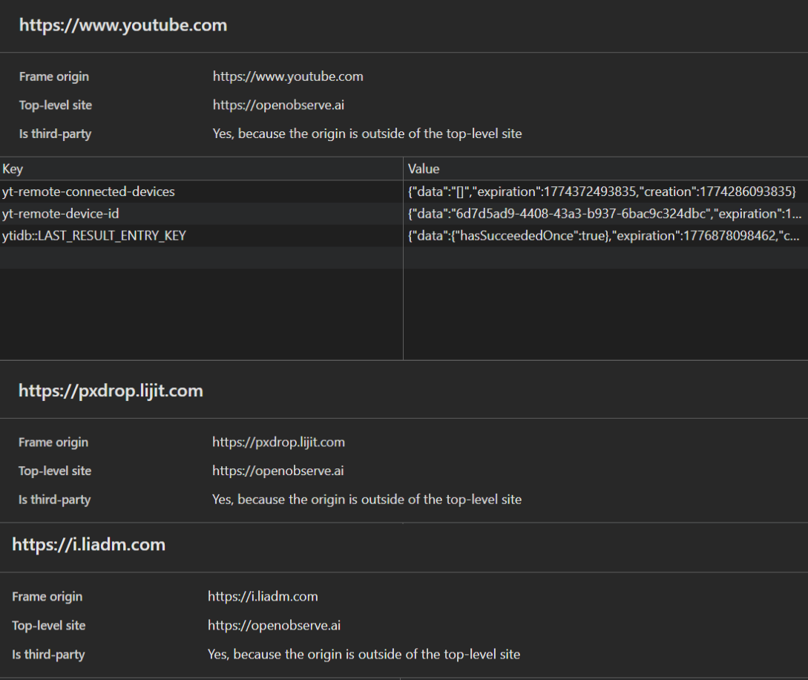

# SaaS Audit Report – OpenObserve

## Overview
This report analyzes the performance, security, and reliability of the OpenObserve web application.

---

## 1. Performance Analysis
### Overview
The application demonstrates strong overall performance with a Lighthouse score of **91/100**, indicating a well-optimized frontend experience. Core performance metrics such as First Contentful Paint (FCP) and Largest Contentful Paint (LCP) are within optimal ranges.

---

### Key Metrics

- **First Contentful Paint (FCP):** 0.8s  
- **Largest Contentful Paint (LCP):** 1.0s  
- **Speed Index:** 1.1s  
- **Total Blocking Time (TBT):** 210ms  
- **Cumulative Layout Shift (CLS):** 0.001  

---

### Insights & Issues

#### 1. Render Blocking Resources
- Estimated savings: ~280ms  
- Certain CSS/JS files are blocking initial rendering.

**Impact:**  
Delays page interactivity and increases perceived load time.

**Recommendation:**  
- Use `defer` or `async` for non-critical JS  
- Inline critical CSS  

---

#### 2. Font Loading Delays
- Estimated savings: ~150ms  

**Impact:**  
Text rendering delay (FOIT/FOUT), affecting user experience.

**Recommendation:**  
- Use `font-display: swap`  
- Preload critical fonts  

---

#### 3. Excessive Preconnect Usage
- More than 4 preconnect connections detected  

**Impact:**  
Unnecessary network overhead and DNS lookups.

**Recommendation:**  
- Limit preconnect to critical origins only  

---

#### 4. Inefficient Cache Policies
- Potential savings: ~824 KiB  

**Impact:**  
Repeated downloads increase load time for returning users.

**Recommendation:**  
- Implement longer cache lifetimes for static assets  

---

#### 5. Unused / Legacy JavaScript
- Unused JS: ~765 KiB  
- Legacy JS: ~30 KiB  

**Impact:**  
Increased bundle size and slower execution.

**Recommendation:**  
- Remove unused code  
- Implement code splitting  
- Serve modern JS bundles  

---

#### 6. Large Network Payloads
- Total transfer size: ~3.4 MB  

**Impact:**  
Slower load times, especially on slower networks.

**Recommendation:**  
- Compress assets (gzip/brotli)  
- Optimize images and scripts  

---

#### 7. Main Thread Work
- Total blocking work: ~4.2s  

**Impact:**  
Delays user interaction and responsiveness.

**Recommendation:**  
- Break large tasks into smaller chunks  
- Use Web Workers where applicable  

---

### Summary

The application is already performing at a high level, but several optimization opportunities exist, particularly around JavaScript execution, caching strategies, and resource loading. Addressing these issues could further improve responsiveness and scalability, especially under real-world network conditions.
### Supporting Evidence

## 2. Best Practices & Code Quality
### Overview

The application scored **54/100 in Best Practices**, indicating several issues related to modern web standards, browser compatibility, and code reliability. These issues primarily stem from deprecated APIs, excessive third-party dependencies, and runtime errors.

---

### Key Issues Identified

#### 1. Use of Deprecated APIs

**Evidence:**
- Deprecated features detected in:
  - LinkedIn Ads (AttributionReporting)
  - SharedStorage API usage (pixel.js)
- Multiple deprecation warnings observed in DevTools

**Impact:**
- Future browser incompatibility
- Potential feature breakage as APIs are removed
- Reduced long-term maintainability

**Recommendation:**
- Replace deprecated APIs with modern alternatives
- Audit third-party scripts for outdated implementations

---

#### 2. Excessive Third-Party Cookies & Scripts

**Evidence:**
- 76 third-party cookies detected
- External dependencies include:
  - Google (reCAPTCHA, Analytics, Ads)
  - LinkedIn Ads
  - HubSpot
  - Clarity
  - YouTube
  - Sovrn / Lijit
  - IP tracking services

**Impact:**
- Increased attack surface
- Privacy and compliance concerns (GDPR risk)
- Performance degradation due to multiple external calls

**Recommendation:**
- Reduce third-party integrations
- Consolidate analytics providers
- Prefer first-party tracking where possible

---

#### 3. Console Errors (Critical Runtime Issues)

**Evidence:**
- CORS failure when calling:
  https://e1.zinclabs.dev/v1/track
- Error:
  "No 'Access-Control-Allow-Origin' header is present"
- Failed network requests and unhandled promise rejections :contentReference[oaicite:0]{index=0}
- Timeout error:
  https://pro.ip-api.com → ERR_CONNECTION_TIMED_OUT

**Impact:**
- Broken analytics / tracking functionality
- Silent failures affecting business metrics
- Poor debugging visibility
- Potential user-facing issues in edge cases

**Recommendation:**
- Fix CORS configuration on backend:
  - Add `Access-Control-Allow-Origin`
- Handle failed requests gracefully
- Remove or replace failing external services

---

#### 4. Browser Issues Detected

**Evidence (DevTools Issues panel):**
- CORS policy misconfiguration
- Deprecated feature usage
- Missing autocomplete attributes
- Quirks Mode rendering warnings

**Impact:**
- Inconsistent rendering across browsers
- Reduced accessibility and UX reliability
- Increased maintenance complexity

**Recommendation:**
- Ensure proper DOCTYPE to avoid Quirks Mode
- Fix CORS headers
- Add missing HTML attributes
- Resolve all DevTools Issues panel warnings

---

#### 5. Missing Source Maps

**Evidence:**
- Large JavaScript bundles without source maps

**Impact:**
- Difficult debugging in production
- Slower issue resolution

**Recommendation:**
- Enable source maps for production debugging (with proper security controls)

---

### Summary

The application shows strong performance but lacks adherence to modern best practices. The primary concerns include reliance on third-party services, deprecated API usage, and runtime errors caused by misconfigured network requests.

Addressing these issues will significantly improve stability, maintainability, and long-term scalability.
### Supporting Evidence

## 3. API & Network Analysis
### Overview

The network and API analysis reveals multiple reliability and configuration issues, particularly related to failed requests, third-party dependencies, and inefficient request handling. While core requests function correctly, several external services fail or introduce latency.

---

### Key Findings

#### 1. CORS Misconfiguration (Critical)

**Evidence:**
- Failed requests to:
  https://e1.zinclabs.dev/v1/track
- Error:
  "No 'Access-Control-Allow-Origin' header is present"
- Multiple failed `track` requests observed in Network tab :contentReference[oaicite:0]{index=0}

**Impact:**
- Analytics/tracking requests are completely broken
- Data loss in tracking pipelines
- Console errors affecting debugging and reliability

**Recommendation:**
- Configure backend to include:
  Access-Control-Allow-Origin: *
  (or restrict to specific domain)
- Ensure proper handling of preflight (OPTIONS) requests

---

#### 2. Failed External API Calls

**Evidence:**
- Request to:
  https://pro.ip-api.com/... → FAILED (timeout ~21s)
- Status:
  net::ERR_CONNECTION_TIMED_OUT

**Impact:**
- Long blocking requests (~21s) degrade performance
- Potential UI delays or hanging states
- Dependency on unreliable external service

**Recommendation:**
- Add timeout handling on frontend
- Replace or remove unreliable IP lookup service
- Use fallback or cached responses

---

#### 3. High Number of Third-Party Requests

**Evidence:**
- Requests to:
  - Google Tag Manager
  - Google Analytics
  - Clarity
  - LinkedIn Ads
  - HubSpot
  - reCAPTCHA
- Numerous `collect`, `track`, `event` calls

**Impact:**
- Increased latency due to multiple external calls
- Dependency on third-party uptime
- Increased attack surface

**Recommendation:**
- Reduce redundant analytics calls
- Consolidate tracking providers
- Lazy-load non-critical scripts

---

#### 4. Repeated Tracking Requests

**Evidence:**
- Multiple `collect`, `event`, `track` calls
- Frequent duplicate analytics requests

**Impact:**
- Unnecessary network load
- Increased client-side processing
- Potential inflated analytics data

**Recommendation:**
- Debounce or batch tracking events
- Audit tracking logic for duplication

---

#### 5. Slow Requests (>500ms)

**Evidence:**
- Several requests in range:
  - 700ms – 1000ms
- Examples:
  - attribution_trigger (~775ms)
  - checkhtml.php (~875ms)

**Impact:**
- Slower page interactivity
- Increased Time to Interactive (TTI)

**Recommendation:**
- Optimize backend response times
- Use caching (CDN / server-side)
- Reduce payload sizes

---

#### 6. Endpoint Exposure Testing

**Tested Endpoints:**
- /api/user  
- /api/search  
- /api/upload  
- /admin  
- /dashboard  
- /login  

**Result:**
- All endpoints returned 404 (Not Found)

**Insight:**
- No obvious public API exposure detected
- Indicates basic endpoint protection or frontend-only routing

**Recommendation:**
- Continue using proper API authentication and routing controls
- Ensure sensitive endpoints are protected via authentication middleware

---

### Summary

The application’s network layer is functional but heavily reliant on third-party services, several of which are misconfigured or failing. The most critical issue is the CORS misconfiguration causing failed API requests, along with slow and unreliable external dependencies.

Improving API reliability, reducing third-party dependency, and optimizing request handling would significantly enhance system stability and performance.
### Supporting Evidence

## 4. Security Analysis

---

## 4. Security Analysis

### Overview

The application demonstrates a generally secure infrastructure with HTTPS enforcement and modern transport security. However, several critical security headers and client-side storage practices introduce potential vulnerabilities, particularly around script injection risks, excessive third-party exposure, and tracking surface.

---

### Key Findings

#### 1. Missing Content Security Policy (Critical)

**Evidence:**
- Content-Security-Policy header is not present
- Reported in security header analysis (Grade: B)

**Impact:**
- Increased risk of Cross-Site Scripting (XSS)
- Malicious scripts can be injected and executed
- No restriction on external script sources

**Recommendation:**

Content-Security-Policy:
  default-src 'self';
  script-src 'self' https://trusted-cdn.com;
  object-src 'none';
#### 2\. Missing Permissions Policy

**Evidence:**

*   Permissions-Policy header not defined
    

**Impact:**

*   Browser APIs (camera, mic, geolocation) are not explicitly restricted
    
*   Potential misuse by third-party scripts
    

**Recommendation:**

Plain textANTLR4BashCC#CSSCoffeeScriptCMakeDartDjangoDockerEJSErlangGitGoGraphQLGroovyHTMLJavaJavaScriptJSONJSXKotlinLaTeXLessLuaMakefileMarkdownMATLABMarkupObjective-CPerlPHPPowerShell.propertiesProtocol BuffersPythonRRubySass (Sass)Sass (Scss)SchemeSQLShellSwiftSVGTSXTypeScriptWebAssemblyYAMLXML`   Permissions-Policy:  camera=(), microphone=(), geolocation=()   `

#### 3\. Excessive Third-Party Script & Tracking Exposure

**Evidence:**

*   Third-party domains:
    
    *   Google (analytics, recaptcha)
        
    *   LinkedIn Ads
        
    *   HubSpot
        
    *   Clarity
        
    *   YouTube
        
    *   Lijit / ad networks
        

**Impact:**

*   Increased attack surface
    
*   Potential data leakage to third parties
    
*   Dependency on external security posture
    

**Recommendation:**

*   Audit and remove non-essential trackers
    
*   Use a tag manager strategy or server-side tracking
    
*   Limit third-party scripts in production
    

#### 4\. Client-Side Storage of Identifiers

**Evidence:**

*   LocalStorage contains:
    
    *   user identifiers (e.g., mv\_user\_id)
        
    *   tracking/session data
        
    *   analytics metadata
        

**Impact:**

*   Sensitive identifiers exposed to browser environment
    
*   Vulnerable to XSS-based data extraction
    
*   No encryption or protection layer
    

**Recommendation:**

*   Avoid storing sensitive identifiers in localStorage
    
*   Use HttpOnly cookies for session data
    
*   Encrypt or minimize stored data
    

#### 5\. Third-Party Storage Contexts

**Evidence:**

*   Multiple third-party storage contexts:
    
    *   lijit.com
        
    *   youtube.com
        
    *   liadm.com
        

**Impact:**

*   Cross-site tracking risks
    
*   Data sharing across origins
    
*   Privacy and compliance concerns
    

**Recommendation:**

*   Reduce third-party embeds where possible
    
*   Implement consent-based loading (GDPR-style)
    
*   Sandbox third-party iframes
    

#### 6\. Server Information Exposure

**Evidence:**

*   Server header reveals:
    
    *   AmazonS3
        
    *   CloudFront
        

**Impact:**

*   Infrastructure fingerprinting
    
*   Helps attackers identify attack vectors
    

**Recommendation:**

*   Remove or obfuscate Server header
    

#### 7\. Security Headers – Good Implementations

**Present:**

*   X-Frame-Options (clickjacking protection)
    
*   X-Content-Type-Options (MIME sniffing protection)
    
*   Strict-Transport-Security (HTTPS enforcement)
    
*   Referrer-Policy (data leakage control)
    

**Insight:**

*   Strong baseline security posture already exists
    
*   Missing headers prevent achieving higher security grade (A)
    

#### 8\. HTTPS & Transport Security (Strong)

**Evidence:**

*   Valid TLS certificate (Amazon-issued)
    
*   Secure connection using modern encryption
    
*   All resources served over HTTPS
    

**Impact:**

*   Data-in-transit is secure
    
*   No mixed content issues detected
    

### Summary

The application has a solid foundational security setup, particularly in transport security and basic headers. However, the absence of a Content Security Policy and Permissions Policy introduces significant client-side risks.

Additionally, heavy reliance on third-party scripts and exposure of identifiers in localStorage increases the attack surface. Addressing these issues would significantly strengthen the overall security posture and reduce risk of client-side exploitation.

### Severity Breakdown

*   🔴 Critical: Missing CSP
    
*   🟠 High: Third-party exposure, localStorage risks
    
*   🟡 Medium: Missing Permissions Policy, server header leakage
    
*   🟢 Low: Overall HTTPS and base headers well configured

### Supporting Evidence

## 5. Storage & Session Management
### Overview

The application makes extensive use of browser storage mechanisms including cookies, localStorage, and third-party storage contexts. While these are commonly used for analytics and session tracking, the current implementation introduces potential security and privacy concerns due to exposure of identifiers and heavy reliance on third-party storage.

---

### Key Findings

#### 1. Extensive Use of Third-Party Cookies

**Evidence:**
- 70+ third-party cookies detected
- Sources include:
  - Google (Analytics, reCAPTCHA, DoubleClick)
  - LinkedIn Ads
  - HubSpot
  - Clarity
  - Lijit / ad networks

**Impact:**
- Increased tracking across multiple domains
- Potential privacy compliance concerns (GDPR, etc.)
- Dependency on third-party data handling policies

**Recommendation:**
- Minimize third-party cookies where possible
- Implement consent-based cookie loading
- Classify cookies (essential vs non-essential)

---

#### 2. Storage of Identifiers in LocalStorage

**Evidence:**
- LocalStorage contains:
  - `mv_user_id`
  - tracking IDs (e.g., `_li_duid`, `_gcl_ls`)
  - analytics-related metadata

**Impact:**
- Sensitive identifiers accessible via JavaScript
- Vulnerable to XSS attacks
- No built-in expiration or protection

**Recommendation:**
- Avoid storing sensitive identifiers in localStorage
- Use secure, HttpOnly cookies for session management
- Implement expiration and rotation strategies

---

#### 3. Lack of Secure Session Handling Indicators

**Evidence:**
- No clear session token handling observed in cookies
- No visible use of HttpOnly session cookies for authentication

**Impact:**
- Potential risk if session management is handled client-side
- Increased exposure to token theft via XSS

**Recommendation:**
- Use HttpOnly, Secure, SameSite cookies for sessions
- Avoid storing authentication tokens in localStorage

---

#### 4. Multiple Third-Party Storage Contexts

**Evidence:**
- Storage access observed from:
  - lijit.com
  - liadm.com
  - youtube.com

- Marked as:
  - “Is third-party: Yes”

**Impact:**
- Cross-site tracking capabilities
- Data shared across multiple origins
- Increased privacy and compliance risks

**Recommendation:**
- Limit third-party embeds and trackers
- Use sandboxed iframes where applicable
- Implement user consent mechanisms

---

#### 5. Cookie Security Attributes (Partial Implementation)

**Evidence:**
- Some cookies include:
  - Secure flag
  - SameSite attributes

- However:
  - Not all cookies consistently configured
  - Heavy reliance on third-party cookie policies

**Impact:**
- Inconsistent security enforcement
- Potential exposure depending on third-party configurations

**Recommendation:**
- Enforce:
  - Secure
  - HttpOnly
  - SameSite=Strict (or Lax where needed)
- Audit all cookies systematically

---

### Summary

The application relies heavily on browser-based storage for tracking and analytics. While functional, this introduces increased exposure of identifiers and reliance on third-party storage systems.

The most significant concerns include:
- Exposure of identifiers in localStorage
- Extensive third-party cookie usage
- Cross-origin storage behavior

Improving storage practices and enforcing stricter session management controls would significantly enhance both security and privacy compliance.

---

### Severity Breakdown

- 🔴 High: LocalStorage exposure of identifiers  
- 🟠 High: Third-party cookies and tracking  
- 🟡 Medium: Session handling visibility  
- 🟢 Low: Partial cookie security attributes present
### Supporting Evidence

## 6. Cookie & Tracking Analysis
## 6. Cookie & Tracking Analysis

### Overview

The application relies heavily on cookies and tracking technologies, with a significant presence of third-party trackers. While these tools support analytics and marketing, the current implementation introduces privacy, performance, and compliance risks.

---

### Key Findings

#### 1. High Volume of Third-Party Cookies

**Evidence:**
- 70+ third-party cookies detected
- Sources include:
  - Google (Analytics, reCAPTCHA, DoubleClick)
  - LinkedIn Ads
  - HubSpot
  - Clarity
  - Lijit ad network

**Impact:**
- Cross-site user tracking across multiple platforms
- Increased exposure to third-party data collection
- Potential GDPR / privacy compliance risks

**Recommendation:**
- Categorize cookies (essential vs non-essential)
- Implement cookie consent banner with granular control
- Block non-essential cookies until user consent

---

#### 2. Cross-Domain Tracking Behavior

**Evidence:**
- Cookies set across multiple domains:
  - google.com
  - linkedin.com
  - hubspot.com
  - lijit.com

**Impact:**
- Enables cross-site tracking and profiling
- Reduces user privacy
- Expands attack surface

**Recommendation:**
- Minimize cross-domain tracking dependencies
- Use first-party analytics where possible
- Implement server-side tracking

---

#### 3. Heavy Reliance on Advertising & Tracking Pixels

**Evidence:**
- Presence of:
  - LinkedIn tracking (`px.ads.linkedin.com`)
  - Google Ads / DoubleClick
  - HubSpot tracking scripts
  - Clarity tracking

**Impact:**
- Increased page load overhead
- Potential performance degradation
- Data sharing with multiple vendors

**Recommendation:**
- Audit necessity of each tracking tool
- Remove redundant or unused trackers
- Consolidate tracking providers

---

### Summary

The application uses a large number of third-party tracking mechanisms, which increases privacy risks and dependency on external services. While common in modern SaaS platforms, optimization and stricter control are recommended to balance analytics needs with performance and compliance.
## 7. Third-Party Dependency Analysis
## 7. Third-Party Dependency Analysis

### Overview

The application depends significantly on third-party scripts and external services. While these enhance functionality (analytics, security, embeds), they also introduce performance overhead, reliability risks, and security considerations.

---

### Key Findings

#### 1. Large Third-Party Script Sizes

**Evidence (Treemap Analysis):**
- Google reCAPTCHA: ~362 KB (largest single resource)
- Google Tag Manager: ~146–170 KB
- Additional analytics and tracking scripts present

**Impact:**
- Increased initial load time
- Higher bandwidth usage
- Slower performance on low-end devices

**Recommendation:**
- Lazy-load non-critical scripts
- Replace heavy dependencies with lighter alternatives
- Load scripts conditionally based on user interaction

---

#### 2. High Number of External Dependencies

**Evidence:**
- Scripts loaded from:
  - gstatic.com (reCAPTCHA)
  - googletagmanager.com
  - cdnjs.cloudflare.com
  - hubspot domains
  - clarity.ms
  - lijit / ad networks

**Impact:**
- Increased attack surface
- Dependency on external uptime and security
- Harder debugging and monitoring

**Recommendation:**
- Reduce dependency count
- Self-host critical libraries where possible
- Monitor third-party performance and failures

---

#### 3. Third-Party Failures Affecting Reliability

**Evidence:**
- Failed API calls:
  - tracking endpoints (CORS errors)
  - IP API timeout (~21s delay)

**Impact:**
- Broken functionality (tracking failures)
- Increased page load time
- Poor user experience

**Recommendation:**
- Implement fallback mechanisms
- Add request timeouts
- Remove unreliable third-party services

---

#### 4. Redundant or Duplicate Script Loading

**Evidence:**
- Multiple analytics and tracking scripts loaded simultaneously
- Duplicate calls observed in network requests

**Impact:**
- Unnecessary network usage
- Increased execution time
- Potential data duplication

**Recommendation:**
- Deduplicate tracking scripts
- Centralize tracking via a single manager (e.g., GTM optimization)

---

### Summary

The application relies heavily on third-party services, many of which contribute significantly to page weight and introduce reliability risks. Optimizing dependency usage would improve performance, reduce failures, and enhance overall system stability.
## Final Summary & Recommendations
## 8. Final Summary & Recommendations

### Overall Assessment

The application demonstrates a strong foundational setup with secure HTTPS implementation, functional APIs, and modern frontend architecture. However, several critical and high-impact issues were identified across performance, security, and dependency management.

The most significant concerns include:
- Missing Content Security Policy (CSP)
- Heavy reliance on third-party scripts and tracking systems
- Exposure of identifiers in client-side storage
- Network reliability issues due to failing external services

---

### Key Risk Areas

- 🔴 **Security Risks**
  - Missing CSP exposes application to XSS attacks
  - LocalStorage usage increases risk of data extraction
  - Lack of strict browser policies

- 🟠 **Performance Risks**
  - Large third-party scripts (reCAPTCHA, GTM)
  - Multiple redundant network requests
  - Slow and failing external APIs

- 🟠 **Privacy & Compliance Risks**
  - Extensive third-party cookie usage
  - Cross-domain tracking behavior
  - Lack of user consent mechanisms

---

### Priority Recommendations

#### Immediate (High Priority)

- Implement Content Security Policy (CSP)
- Fix CORS issues in tracking APIs
- Remove or replace failing external APIs
- Audit and reduce third-party scripts

---

#### Short-Term Improvements

- Optimize script loading (lazy load, defer)
- Reduce analytics redundancy
- Implement cookie consent management
- Move sensitive data out of localStorage

---

#### Long-Term Improvements

- Shift to first-party or server-side analytics
- Implement stricter browser security headers
- Continuously monitor third-party dependencies
- Establish performance and security monitoring pipelines

---

### Final Verdict

The application is functional and relatively well-structured, but optimization in security, performance, and dependency management is required to reach production-grade robustness.

Addressing the highlighted issues would:
- Improve load performance
- Reduce security vulnerabilities
- Enhance user privacy and compliance
- Increase overall system reliability

---

### Audit Score (Estimated)

- Performance: 91/100  
- Accessibility: 91/100  
- Best Practices: 54/100  
- SEO: 100/100  

**Overall:** ⚠️ Good foundation, needs optimization for production-grade quality
